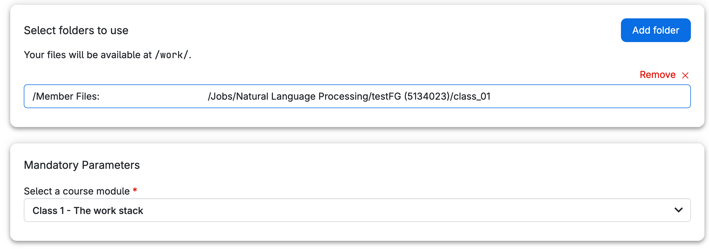

# NLP Demo Course

This course contains all of the code and data related to the module [Natural Language Processing](https://kursuskatalog.au.dk/en/course/107427/Natural-language-processing) taken as part of the [MSc in Cognitive Science](https://masters.au.dk/cognitivescience) at Aarhus University.

This guide will help you use the UCloud system to access course materials.

## Submitting a UCloud Job

Follow these instructions to set up and submit a UCloud job for the course.
For more general instructions on how to submit a job, consult the [UCloud docs](https://docs.cloud.sdu.dk/guide/submitting.html).

### Select a machine type

From the job submission page https://cloud.sdu.dk/app/jobs/create?app=nlp-demo-course__147222U005,
choose a machine type that meets the computational requirements for your class:

* Classes 1 to 5: Use machines with only vCPU resources, such as `u1-standard-4` and `uc1-gc1-4`.
* Classes 7 to 9: Use machines with GPU resources for more computationally intensive tasks. Good choices here would be `uc1-l4-3`, `uc1-l40-1`, or `u3-gpu-1`.

You can select the machine type from the dropdown menu when configuring your UCloud job.
### Select folders to use (optional)

You can mount a UCloud folder/directory to the job by clicking the blue button 'Add folder' and selecting the folder you want to mount. 
The selected folder will be available inside the running instance of the course on the path `/work/[name_of_selected_folder]`. 

> [!NOTE]
> Only changes inside `/work` will be persisted between runs. 

### Select course module

Choose the relevant class (module) from the dropdown menu in the UCloud job configuration interface.
The course materials (instructions and datasets) are hosted in a [GitHub](https://github.com/jeselginAU/demo-NLP-Course-AU) repository managed by the teacher. Once you start the course app, the course materials for the selected course module will be downloaded to the path `/work/class_[module#]`.
When the job is completed, the class_[module#] folder will be available in your UCloud drive inside the Jobs folder (https://docs.cloud.sdu.dk/guide/monitoring.html#job-completed).
### Re-download course files

By default, this parameter is set to `false` meaning the course materials are downloaded, except if a folder called `/work/class_[module#]` already exists.
In other words, if you select class 1 and you mount a folder called `class_01` by using the parameter _Select folders to use_, 

files from the teachers GitHub repos won't be re-downloaded. 

You can overwrite the existing folder by setting the option _Re-download course files_  to `true`. This will overwrite `/work/class_[module#]` inside the job and the mounted UCloud storage.

### Initialization

For information on how to use the _Initialization_ parameter, please refer to the [Initialization - Bash script](https://docs.cloud.sdu.dk/hands-on/init-sh.html), [Initialization - Conda packages](https://docs.cloud.sdu.dk/hands-on/init-conda.html), and [Initialization - pip packages](https://docs.cloud.sdu.dk/hands-on/init-pip.html) section of the documentation.
